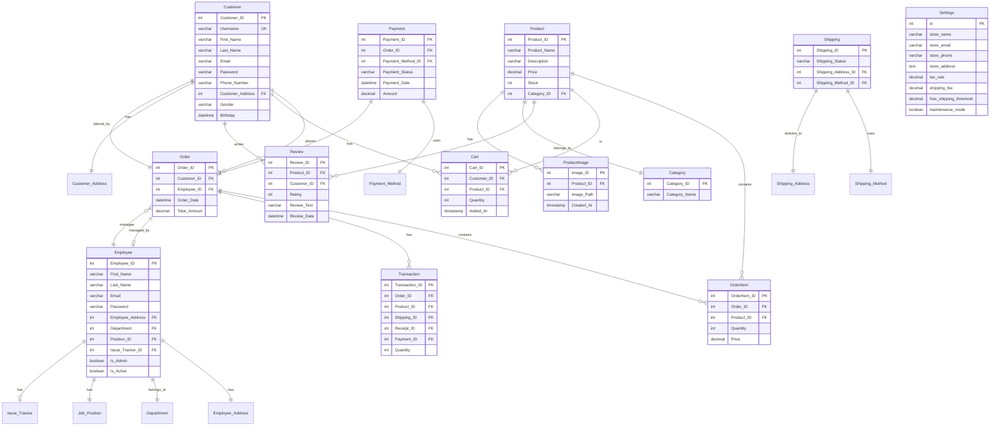

# Shoepee - Online Shoe Store

Final project for Fundamentals of Database Systems - Team Ciderella

## Team Members
- Kent Jasper C. Sisi
- Harvie C. Babuyo
- Precious Gamalo
- Richter Anthony Yap
- Thomas Gabriel Martinez

## Overview
Shoepee is a comprehensive e-commerce platform specializing in footwear. The system includes both customer-facing features for shopping and administrative tools for managing the store.

[Insert Screenshot of Homepage]

## Features

### Customer Features
- User registration and authentication
- Product browsing with search and filtering
- Shopping cart management
- Secure checkout process
- Order tracking
- Profile management

### Admin Features
- Product management (CRUD operations)
- Order management
- Employee management
- Sales tracking and reporting
- Store settings configuration
- Database maintenance tools

## Technology Stack
- PHP 7.4+
- MySQL 5.7+
- Bootstrap 5.3
- HTML5/CSS3
- JavaScript

## Installation

1. Clone the repository:

```bash
git clone https://github.com/kntjspr/crud-ecommerce.git
```

2. Set up your web server (e.g., XAMPP, WAMP) and place the files in the web root directory.

3. Create the database:
   - Navigate to `database_reset.php` in your browser
   - Click "Initialize Database" to set up the database structure
   - The system will create all necessary tables

4. Configure database connection:
   - Open `config/database.php`
   - Update the database credentials if needed:
     ```php
     $host = 'localhost';
     $username = 'root';
     $password = '';
     $database = 'shoepee_db';
     ```

5. Set up initial admin account:
   - Use the employee registration page
   - Default admin credentials will be created

## Database Structure

### Entity Relationship Diagram


### Main Tables
1. **Users**
   - Customer
   - Employee
   - Authentication data

2. **Products**
   - Product details
   - Categories
   - Images
   - Stock management

3. **Orders**
   - Order information
   - Order items
   - Payment details
   - Shipping information

4. **System**
   - Store settings
   - Payment methods
   - Shipping methods

## Screenshots
[Insert key screenshots of the system]
- Homepage
- Product Listing
- Shopping Cart
- Admin Dashboard
- Order Management
- Product Management

## Contributing
This project is part of an academic requirement. While we appreciate feedback, we are not accepting direct contributions at this time.

## License
This project is created for educational purposes. All rights reserved.

## Acknowledgments
Special thanks to our instructor and the Fundamentals of Database Systems course for guiding us through this project.
