# Shoepee - Online Shoe Store

Final project for Fundamentals of Database Systems

## Overview
Shoepee is a comprehensive e-commerce platform specializing in footwear. The system includes both customer-facing features for shopping and administrative tools for managing the store.


## Features

### Customer Features
- User registration and authentication
- Product browsing with search and filtering
- Shopping cart management
- Secure checkout process
- Order tracking
- Profile management

### Admin Features
- Product management (CRUD operations)
- Order management
- Employee management
- Sales tracking and reporting
- Store settings configuration
- Database maintenance tools

## Technology Stack
- PHP 7.4+
- MySQL 5.7+
- Bootstrap 5.3
- HTML5/CSS3
- JavaScript

## Installation

### Prerequisites
- PHP 7.4 or higher
- MySQL Server
- PDO PHP Extension
- Web server (Apache/Nginx)

### Automatic Installation
1. Copy all files to your web server directory
2. Access the site through your web browser
3. If this is a first-time installation, you'll be automatically redirected to the setup wizard
4. Follow the setup wizard steps:
   - System requirements check
   - Database initialization
   - Setup completion

### Manual Installation
If you prefer manual installation:
1. Create a MySQL database named `shoepee_db`
2. Run `database_init.php` to create tables and initial data
3. Access the site through your web browser

### Default Admin Credentials
After installation, you can log in with:
- Email: admin@shoepee.com
- Password: admin123

**Important:** Change these credentials after your first login!

### Database Reset
If you need to reset the database:
1. Access `database_reset.php`
2. Follow the prompts to reset and reinitialize the database

## Database Structure

### Entity Relationship Diagram

```mermaid
erDiagram
    Customer ||--o{ Order : places
    Customer ||--o{ Cart : has
    Customer ||--o{ Review : writes
    Customer ||--|| Customer_Address : has
    Customer {
        int Customer_ID PK
        varchar Username UK
        varchar First_Name
        varchar Last_Name
        varchar Email
        varchar Password
        varchar Phone_Number
        int Customer_Address FK
        varchar Gender
        datetime Birthday
    }

    Employee ||--o{ Order : manages
    Employee ||--|| Employee_Address : has
    Employee ||--|| Department : belongs_to
    Employee ||--|| Job_Position : has
    Employee ||--o| Issue_Tracker : has
    Employee {
        int Employee_ID PK
        varchar First_Name
        varchar Last_Name
        varchar Phone_Number
        int Employee_Address FK
        varchar Gender
        datetime Birthday
        varchar Email
        varchar Password
        int Department FK
        decimal Salary
        varchar SSS_Number
        varchar Pag_IBIG
        varchar PhilHealth
        varchar TIN
        int Issue_Tracker_ID FK
        int Position_ID FK
        boolean Is_Admin
        boolean Is_Active
    }

    Product ||--o{ OrderItem : contains
    Product ||--o{ Cart : in
    Product ||--o{ Review : has
    Product ||--|| Category : belongs_to
    Product ||--o{ ProductImage : has
    Product {
        int Product_ID PK
        varchar Product_Name
        varchar Description
        decimal Price
        int Stock
        int Category_ID FK
    }

    Category {
        int Category_ID PK
        varchar Category_Name
    }

    Order ||--o{ OrderItem : contains
    Order ||--o{ Transaction : has
    Order ||--|| Customer : placed_by
    Order ||--o| Employee : managed_by
    Order {
        int Order_ID PK
        int Customer_ID FK
        datetime Order_Date
        decimal Total_Amount
        int Employee_ID FK
    }

    OrderItem {
        int OrderItem_ID PK
        int Order_ID FK
        int Product_ID FK
        int Quantity
        decimal Price
    }

    Payment ||--|| Payment_Method : uses
    Payment ||--|| Order : belongs_to
    Payment {
        int Payment_ID PK
        int Order_ID FK
        int Payment_Method_ID FK
        varchar Payment_Status
        datetime Payment_Date
        decimal Amount
    }

    Payment_Method {
        int Payment_Method_ID PK
        varchar Method_Name
        varchar Provider
        decimal Transaction_Fee
    }

    Transaction {
        int Transaction_ID PK
        int Order_ID FK
        int Shipping_ID FK
        int Receipt_ID FK
        int Product_ID FK
        int Payment_ID FK
        int Quantity
    }

    Shipping ||--|| Shipping_Method : uses
    Shipping ||--|| Shipping_Address : delivers_to
    Shipping {
        int Shipping_ID PK
        varchar Shipping_Status
        int Shipping_Address_ID FK
        int Shipping_Method_ID FK
    }

    Shipping_Method {
        int Shipping_Method_ID PK
        varchar Method_Name UK
        decimal Cost
        varchar Estimated_Delivery_Time
    }

    Cart {
        int Cart_ID PK
        int Customer_ID FK
        int Product_ID FK
        int Quantity
        timestamp Added_At
    }

    Settings {
        int id PK
        varchar store_name
        varchar store_email
        varchar store_phone
        text store_address
        decimal tax_rate
        decimal shipping_fee
        decimal free_shipping_threshold
        boolean maintenance_mode
        timestamp created_at
        timestamp updated_at
    }

    ProductImage {
        int Image_ID PK
        int Product_ID FK
        varchar Image_Path
        timestamp Created_At
    }

    Review {
        int Review_ID PK
        int Product_ID FK
        int Customer_ID FK
        int Rating
        varchar Review_Text
        datetime Review_Date
    }

    Receipt {
        int Receipt_ID PK
        decimal Tax_Amount
        decimal Total_Amount
        varchar Type
    }

    Job_Position {
        int Position_ID PK
        varchar Title
        varchar Description
    }

    Department {
        int Department_ID PK
        varchar Department_Name
        varchar Description
    }

    Issue_Tracker {
        int Issue_Tracker_ID PK
        varchar Description
        varchar Status
    }

    Employee_Address {
        int Employee_Address_ID PK
        varchar Street
        varchar Barangay
        varchar Town_City
        varchar Province
        varchar Region
        int Postal_Code
    }

    Customer_Address {
        int Customer_Address_ID PK
        varchar Street
        varchar Barangay
        varchar Town_City
        varchar Province
        varchar Region
        int Postal_Code
    }

    Shipping_Address {
        int Shipping_Address_ID PK
        varchar Street
        varchar Barangay
        varchar Town_City
        varchar Province
        varchar Region
        int Postal_Code
    }
```


### Main Tables
1. **Users**
   - Customer
   - Employee
   - Authentication data

2. **Products**
   - Product details
   - Categories
   - Images
   - Stock management

3. **Orders**
   - Order information
   - Order items
   - Payment details
   - Shipping information

4. **System**
   - Store settings
   - Payment methods
   - Shipping methods

## Security
- Passwords are hashed using PHP's password_hash()
- PDO prepared statements for database queries
- Input validation and sanitization

## Directory Structure
```
shoepee/
├── config/
│   └── database.php
├── uploads/
│   └── products/
├── index.php
├── setup.php
├── database_init.php
└── database_reset.php
```

## Troubleshooting
1. Database Connection Issues
   - Verify MySQL is running
   - Check database credentials in config/database.php
   - Ensure proper permissions are set

2. Setup Wizard Issues
   - Verify PHP version (7.4+)
   - Enable PDO extension
   - Set proper file permissions

## Contributing
This project is part of an academic requirement. While we appreciate feedback, we are not accepting direct contributions at this time.

## License
This project is created for educational purposes. All rights reserved.

## Acknowledgments
Special thanks to our instructor and the Fundamentals of Database Systems course for guiding us through this project.
