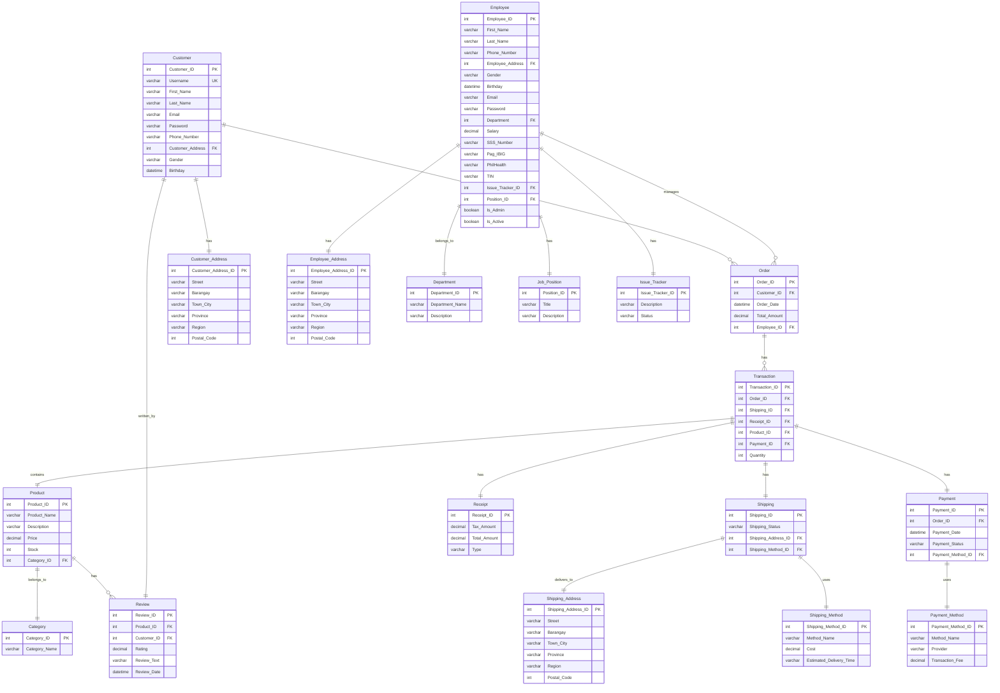

# E-commerce Platform

A comprehensive e-commerce solution built with PHP and MySQL, featuring both customer-facing shopping experience and employee management system. This platform provides a complete solution for managing a shoe store's online presence, inventory, employees, and sales. 

This project is not battle-tested and is not fit for production. This was made as a final project in our Fundamentals of Database Systems subject to demonstrate CRUD operations and relationships between tables.

## Key Features

### Customer Features
- User registration and authentication
- Product browsing and searching
- Shopping cart functionality
- Order placement and tracking
- Product reviews and ratings
- Secure checkout process

### Admin/Employee Features
- Employee management system
- Inventory control
- Order processing
- Sales tracking
- Product management
- Department and position management

### Technical Features
- PDO database abstraction
- Secure authentication system
- Role-based access control
- Input validation and sanitization
- XSS and CSRF protection
- Responsive Bootstrap UI

## Tech Stack
- PHP 7.4+
- MySQL 5.7+
- Bootstrap 5
- HTML5/CSS3

## Security Features
- SQL Injection Prevention
- XSS Protection
- CSRF Protection
- Input Validation
- Secure Session Management

## Database Architecture
The system uses a comprehensive database design with the following key components:
- Customer and Employee management
- Product and Category management
- Order processing system
- Payment and Shipping handling
- Review and Rating system

## Directory Structure

```
crud-ecommerce/
├── config/
│   └── database.php
├── assets/ (future assets like image uploads should be stored in here)
│   ├── css/
│   └── images/
├── includes/
│   └── navbar.php
├── uploads/
├── index.php
├── login.php
├── register.php
├── products.php
├── product_details.php
├── cart.php
├── checkout.php
├── order_confirmation.php
├── database_init.php
└── README.md
```

## Database Schema

The database follows a comprehensive schema designed for an e-commerce platform:

- Customer Management
  - Customer information
  - Customer addresses
  - Authentication details

- Product Management
  - Product details
  - Categories
  - Stock levels
  - Pricing

- Order Processing
  - Order details
  - Transaction records
  - Payment processing
  - Shipping information

- Employee Management
  - Employee information
  - Positions
  - Issue tracking


## Installation

1. Clone the repository:

```bash
git clone https://github.com/kntjspr/crud-ecommerce.git
cd crud-ecommerce
```


2. Set up web server
- Point your web server to the project directory
- Ensure PHP 7.4+ is installed
- Enable required PHP extensions (PDO, MySQL)

```bash
chmod 755 -R crud-ecommerce/
```


3. Configure database connection
- Copy `config/database.example.php` to `config/database.php`
- Update database credentials


4. Initialize the database

```bash
php database_init.php
```
or

`localhost/database_init.php`


### Setting Up Admin Account
1. After installation, the system requires an initial admin account setup
2. Navigate to `admin_dashboard.php` in your browser
3. You will be presented with the admin registration form
4. Fill in the required details:
   - Personal Information (name, email, password)
   - Contact Details (phone number, address)
   - Employment Information (SSS, TIN, etc.)
5. Submit the form to create your admin account
6. You will be redirected to the login page
7. Log in with your email and password

### Employee Management
Once logged in as admin, you can:
1. Create new employee accounts:
   - Navigate to "Register Employee" in the admin dashboard
   - Fill in employee details
   - Assign roles and permissions
   - Set department and position

  2. Manage existing employees:
   - View all employees in the admin dashboard
   - Edit employee information
   - Activate/deactivate accounts
   - Assign admin privileges
   - Update employment details

### Product Management
As an admin, you can:
1. Add new products:
   - Navigate to "Manage Products"
   - Click "Add New Product"
   - Fill in product details
   - Set pricing and stock levels

2. Update existing products:
   - Edit product information
   - Update stock levels
   - Modify pricing
   - Manage product categories


## Customer Usage

1. Start by registering a new customer account
2. Browse products by category
3. Add products to cart
4. Proceed to checkout
5. Select shipping and payment methods
6. Complete the order
7. Track order status

## Contributing

1. Fork the repository
2. Create your feature branch
3. Commit your changes
4. Push to the branch
5. Create a new Pull Request

## License

This project is licensed under the MIT License - see the LICENSE file for details.

## Support

For support, please email kntjspr@pm.me or create an issue in the repository.

## Acknowledgments

- Bootstrap for the UI components
- PHP PDO for database operations
- MySQL for the database system 


---

## Problems encountered:
The current ER diagram wasn't strictly followed due to some problems encountered during the development process.

#### Table Name Changes:
- Position was renamed to Job_Position to avoid MySQL reserved word conflicts
- Phone_Number in both Customer and Employee tables is VARCHAR(20) instead of INT(11) to accommodate phone number formats

#### Additional Relationships:
- Transaction table has a Quantity field that wasn't in the ER diagram

- Transaction table acts as a junction table between Order, Product, Shipping, Receipt, and Payment

#### Authentication Fields:
- Added Password field to Customer table
- Added Email field to Customer table for login
- Made Username UNIQUE in Customer table
- Added NOT NULL constraints on important fields
- Added DEFAULT values for some fields (e.g., Is_Admin, Is_Active)
- Added UNIQUE constraint on Username in Customer table


---

## Revised ER Diagram (ERD)


