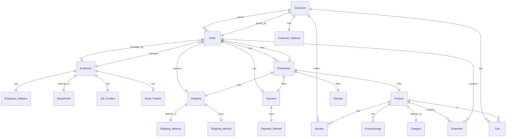

# Shoepee Database Design

## 1. Conceptual Design

### Entity-Relationship Diagram (High Level)

```mermaid
graph TB
    subgraph User Management
        Customer[Customer<br>PK: Customer_ID]
        Employee[Employee<br>PK: Employee_ID]
        CustomerAddr[Customer Address<br>PK: Customer_Address_ID]
        EmployeeAddr[Employee Address<br>PK: Employee_Address_ID]
        Department[Department<br>PK: Department_ID]
        JobPosition[Job Position<br>PK: Position_ID]
        IssueTracker[Issue Tracker<br>PK: Issue_Tracker_ID]
    end
    
    subgraph Product Management
        Product[Product<br>PK: Product_ID]
        Category[Category<br>PK: Category_ID]
        Review[Review<br>PK: Review_ID]
        ProductImage[Product Image<br>PK: Image_ID]
    end
    
    subgraph Order Processing
        Order[Order<br>PK: Order_ID]
        OrderItem[Order Item<br>PK: OrderItem_ID]
        Cart[Cart<br>PK: Cart_ID]
        Payment[Payment<br>PK: Payment_ID]
        PaymentMethod[Payment Method<br>PK: Payment_Method_ID]
        Shipping[Shipping<br>PK: Shipping_ID]
        ShippingMethod[Shipping Method<br>PK: Shipping_Method_ID]
        ShippingAddr[Shipping Address<br>PK: Shipping_Address_ID]
        Receipt[Receipt<br>PK: Receipt_ID]
        Transaction[Transaction<br>PK: Transaction_ID]
    end
    
    subgraph System Management
        Settings[Settings<br>PK: id]
    end
    
    %% User Management Relations
    Customer -->|has| CustomerAddr
    Employee -->|has| EmployeeAddr
    Employee -->|belongs to| Department
    Employee -->|has| JobPosition
    Employee -->|tracks| IssueTracker
    
    %% Product Management Relations
    Product -->|belongs to| Category
    Product -->|has many| ProductImage
    Product -->|has many| Review
    Customer -->|writes| Review
    
    %% Order Processing Relations
    Customer -->|places| Order
    Employee -->|manages| Order
    Order -->|contains| OrderItem
    Product -->|included in| OrderItem
    Customer -->|has| Cart
    Product -->|stored in| Cart
    Order -->|has| Payment
    Payment -->|uses| PaymentMethod
    Order -->|has| Shipping
    Shipping -->|uses| ShippingMethod
    Shipping -->|delivers to| ShippingAddr
    Order -->|generates| Receipt
    Transaction -->|links| Order
    Transaction -->|links| Payment
    Transaction -->|links| Shipping
    Transaction -->|links| Receipt
    Transaction -->|links| Product
```


### Detailed Entity Relationships


## 2. Logical Design

### Data Structure Diagram

```mermaid
classDiagram
    class Customer {
        +Customer_ID INT(5) PK
        +Username VARCHAR(50) UK
        +First_Name VARCHAR(50)
        +Last_Name VARCHAR(50)
        +Email VARCHAR(50)
        +Password VARCHAR(255)
        +Phone_Number VARCHAR(20)
        +Customer_Address INT(5) FK
        +Gender VARCHAR(10)
        +Birthday DATETIME
    }
    
    class Employee {
        +Employee_ID INT(5) PK
        +First_Name VARCHAR(25)
        +Last_Name VARCHAR(25)
        +Phone_Number VARCHAR(20)
        +Employee_Address INT(5) FK
        +Gender VARCHAR(10)
        +Birthday DATETIME
        +Email VARCHAR(50)
        +Password VARCHAR(255)
        +Department INT(5) FK
        +Salary DECIMAL(10,2)
        +SSS_Number VARCHAR(20)
        +Pag_IBIG VARCHAR(20)
        +PhilHealth VARCHAR(20)
        +TIN VARCHAR(20)
        +Issue_Tracker_ID INT(5) FK
        +Position_ID INT(5) FK
        +Is_Admin BOOLEAN
        +Is_Active BOOLEAN
    }
    
    class Address {
        <<Interface>>
        +Street VARCHAR(25)
        +Barangay VARCHAR(25)
        +Town_City VARCHAR(25)
        +Province VARCHAR(25)
        +Region VARCHAR(25)
        +Postal_Code INT(4)
    }
    
    class Customer_Address {
        +Customer_Address_ID INT(5) PK
        +implements Address
    }
    
    class Employee_Address {
        +Employee_Address_ID INT(5) PK
        +implements Address
    }
    
    class Shipping_Address {
        +Shipping_Address_ID INT(5) PK
        +implements Address
    }
    
    class Product {
        +Product_ID INT(5) PK
        +Product_Name VARCHAR(100)
        +Description VARCHAR(500)
        +Price DECIMAL(10,2)
        +Stock INT(5)
        +Category_ID INT(5) FK
    }
    
    class Category {
        +Category_ID INT(5) PK
        +Category_Name VARCHAR(100)
    }
    
    class Order {
        +Order_ID INT(5) PK
        +Customer_ID INT(5) FK
        +Order_Date DATETIME
        +Total_Amount DECIMAL(10,2)
        +Employee_ID INT(5) FK
    }
    
    class OrderItem {
        +OrderItem_ID INT PK
        +Order_ID INT FK
        +Product_ID INT FK
        +Quantity INT
        +Price DECIMAL(10,2)
    }
    
    class Payment {
        +Payment_ID INT PK
        +Order_ID INT FK
        +Payment_Method_ID INT FK
        +Payment_Status VARCHAR(50)
        +Payment_Date DATETIME
        +Amount DECIMAL(10,2)
    }
    
    class Payment_Method {
        +Payment_Method_ID INT(5) PK
        +Method_Name VARCHAR(100)
        +Provider VARCHAR(100)
        +Transaction_Fee DECIMAL(10,2)
    }
    
    class Shipping {
        +Shipping_ID INT(5) PK
        +Shipping_Status VARCHAR(20)
        +Shipping_Address_ID INT(5) FK
        +Shipping_Method_ID INT(5) FK
    }
    
    class Shipping_Method {
        +Shipping_Method_ID INT PK
        +Method_Name VARCHAR(50) UK
        +Cost DECIMAL(10,2)
        +Estimated_Delivery_Time VARCHAR(50)
    }
    
    class Transaction {
        +Transaction_ID INT(5) PK
        +Order_ID INT(5) FK
        +Shipping_ID INT(5) FK
        +Receipt_ID INT(5) FK
        +Product_ID INT(5) FK
        +Payment_ID INT(5) FK
        +Quantity INT(5)
    }
    
    class Settings {
        +id INT PK
        +store_name VARCHAR(100)
        +store_email VARCHAR(100)
        +store_phone VARCHAR(20)
        +store_address TEXT
        +tax_rate DECIMAL(5,2)
        +shipping_fee DECIMAL(10,2)
        +free_shipping_threshold DECIMAL(10,2)
        +maintenance_mode BOOLEAN
        +created_at TIMESTAMP
        +updated_at TIMESTAMP
    }
    
    class Review {
        +Review_ID INT(5) PK
        +Product_ID INT(5) FK
        +Customer_ID INT(5) FK
        +Rating INT(1)
        +Review_Text VARCHAR(500)
        +Review_Date DATETIME
    }
    
    class Receipt {
        +Receipt_ID INT(5) PK
        +Tax_Amount DECIMAL(10,2)
        +Total_Amount DECIMAL(10,2)
        +Type VARCHAR(20)
    }
    
    Customer "1" -- "0..*" Order
    Employee "1" -- "0..*" Order
    Product "1" -- "0..*" OrderItem
    Order "1" -- "1..*" OrderItem
    Order "1" -- "1" Payment
    Order "1" -- "1" Shipping
    Customer_Address --|> Address
    Employee_Address --|> Address
    Shipping_Address --|> Address
```


## 3. Physical Design

[Previous SQL CREATE TABLE statements and other sections remain the same...]
``` 