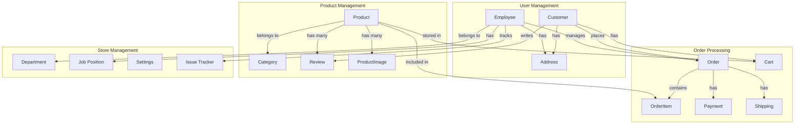
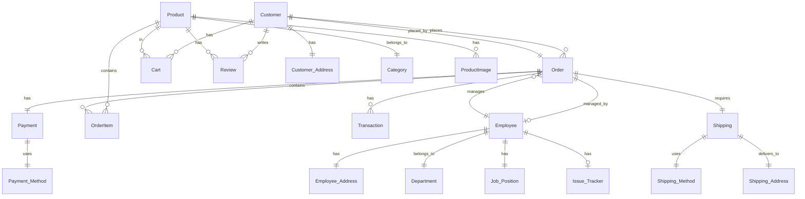
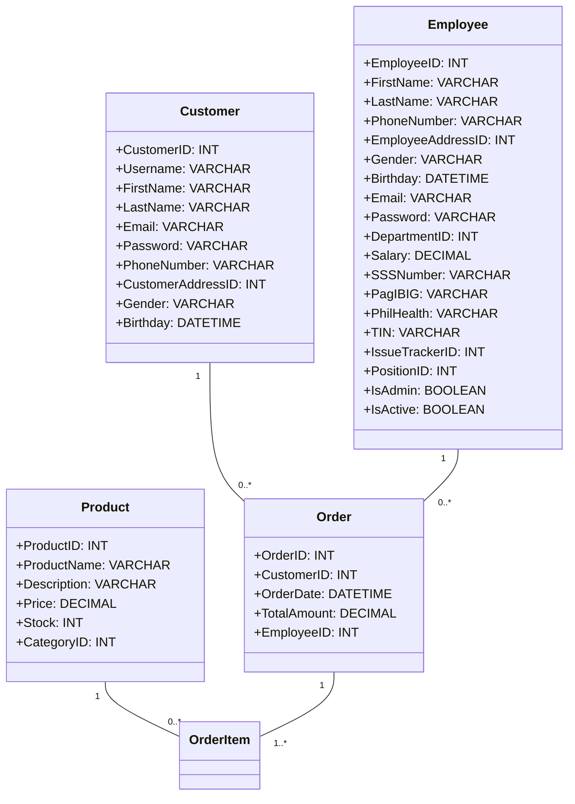
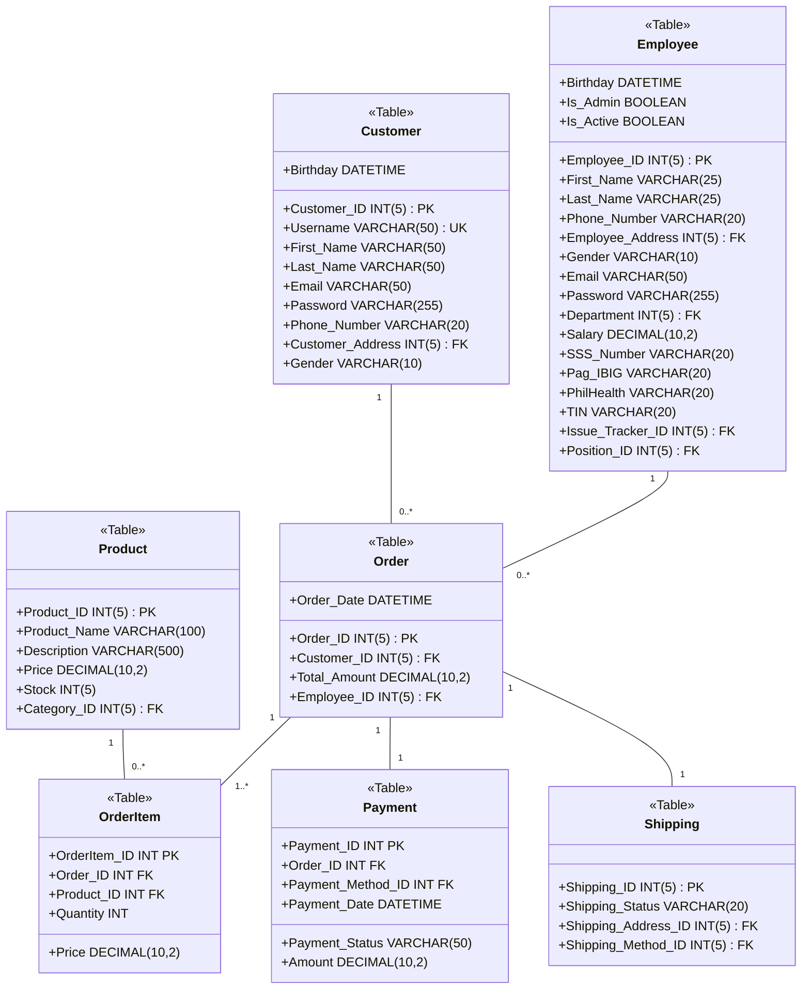

# Shoepee Database Design

## 1. Conceptual Design

### Entity-Relationship Diagram (High Level)


### Detailed Entity Relationships


## 2. Logical Design

### Data Structure Diagram


## 3. Physical Design

### Database Schema


### Table Structures

[Previous SQL CREATE TABLE statements remain the same...]

### Indexes and Optimization
[Previous content remains the same...]

### Data Types and Constraints
[Previous content remains the same...]

### Security Measures
[Previous content remains the same...]

### Performance Considerations
[Previous content remains the same...]
``` 