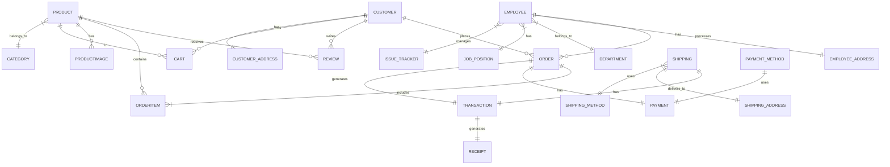
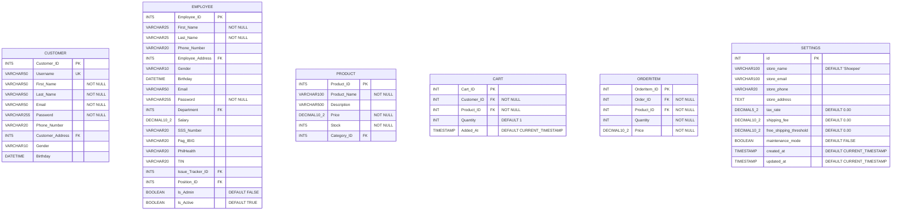

# Shoepee Database Design

This document outlines the database design for the Shoepee e-commerce system. The design is critical as it handles sensitive customer data, financial transactions, and inventory management.

## 1. Conceptual Design
High-level view of main entities and their relationships.



## 2. Logical Design
Entity relationships with attributes.

```mermaid
erDiagram
    CUSTOMER {
        CustomerID PK
        Username UK
        FirstName
        LastName
        Email
        Password
        PhoneNumber
        CustomerAddress FK
        Gender
        Birthday
    }
    EMPLOYEE {
        EmployeeID PK
        FirstName
        LastName
        PhoneNumber
        EmployeeAddress FK
        Gender
        Birthday
        Email
        Password
        Department FK
        Salary
        SSSNumber
        PagIBIG
        PhilHealth
        TIN
        IssueTrackerID FK
        PositionID FK
        IsAdmin
        IsActive
    }
    PRODUCT {
        ProductID PK
        ProductName
        Description
        Price
        Stock
        CategoryID FK
    }
    ORDER {
        OrderID PK
        CustomerID FK
        OrderDate
        TotalAmount
        EmployeeID FK
    }
    TRANSACTION {
        TransactionID PK
        OrderID FK
        ShippingID FK
        ReceiptID FK
        ProductID FK
        PaymentID FK
        Quantity
    }
    SHIPPING {
        ShippingID PK
        ShippingStatus
        ShippingAddressID FK
        ShippingMethodID FK
    }
```

## 3. Physical Design
Complete database schema with data types and constraints.



## Key Features

1. Full employee management system with HR data (SSS, PhilHealth, TIN, PagIBIG)
2. Complete order processing system with order items tracking
3. Multi-address support (Employee, Customer, Shipping addresses as separate entities)
4. Product management with categories and images
5. Review and rating system with 1-5 scale validation
6. Multiple payment methods (Credit Card, E-Wallet, Cash on Delivery)
7. Multiple shipping methods with cost and delivery time estimates
8. Cart system with unique customer-product combinations
9. Store settings management with tax rates and shipping thresholds
10. Comprehensive transaction tracking with receipts
11. Issue tracking system for employees
12. Default admin account system

## Design Principles

1. Referential integrity through foreign key constraints
2. Data normalization (separate address entities)
3. Proper data type selection (VARCHAR lengths optimized)
4. Security features (password hashing)
5. Audit capabilities (timestamps on critical tables)
6. Default values for critical fields
7. Unique constraints where necessary (Username, Email)
8. Check constraints (Rating 1-5)
``` 