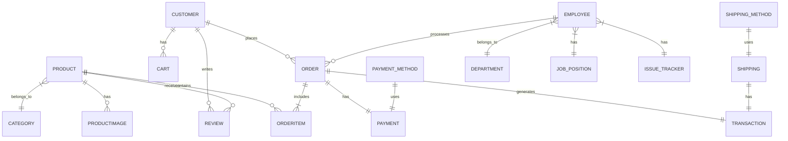

# Shoepee Database Design

This document outlines the database design for the Shoepee e-commerce system. The design is critical as it handles sensitive customer data, financial transactions, and inventory management.

## 1. Conceptual Design
High-level view of main entities and their relationships.



## 2. Logical Design
Entity relationships with attributes (without data types).

```mermaid
erDiagram
    CUSTOMER {
        CustomerID PK
        Username
        FirstName
        LastName
        Email
        Password
        PhoneNumber
        Gender
        Birthday
    }
    EMPLOYEE {
        EmployeeID PK
        FirstName
        LastName
        PhoneNumber
        Gender
        Birthday
        Email
        Password
        Salary
        SSSNumber
        PagIBIG
        PhilHealth
        TIN
        IsAdmin
        IsActive
    }
    PRODUCT {
        ProductID PK
        ProductName
        Description
        Price
        Stock
        CategoryID FK
    }
    ORDER {
        OrderID PK
        CustomerID FK
        OrderDate
        TotalAmount
        EmployeeID FK
    }
    TRANSACTION {
        TransactionID PK
        OrderID FK
        ShippingID FK
        ReceiptID FK
        ProductID FK
        PaymentID FK
        Quantity
    }
    SHIPPING {
        ShippingID PK
        ShippingStatus
        AddressID FK
        MethodID FK
    }
```

## 3. Physical Design
Complete database schema with data types and constraints.

```mermaid
erDiagram
    CUSTOMER {
        INT(5) Customer_ID PK
        VARCHAR(50) Username UK
        VARCHAR(50) First_Name
        VARCHAR(50) Last_Name
        VARCHAR(50) Email
        VARCHAR(255) Password
        VARCHAR(20) Phone_Number
        INT(5) Customer_Address FK
        VARCHAR(10) Gender
        DATETIME Birthday
    }
    PRODUCT {
        INT(5) Product_ID PK
        VARCHAR(100) Product_Name
        VARCHAR(500) Description
        DECIMAL(10,2) Price
        INT(5) Stock
        INT(5) Category_ID FK
    }
    ORDER {
        INT(5) Order_ID PK
        INT(5) Customer_ID FK
        DATETIME Order_Date
        DECIMAL(10,2) Total_Amount
        INT(5) Employee_ID FK
    }
    PAYMENT {
        INT Payment_ID PK
        INT Order_ID FK
        INT Payment_Method_ID FK
        VARCHAR(50) Payment_Status
        DATETIME Payment_Date
        DECIMAL(10,2) Amount
    }
    TRANSACTION {
        INT(5) Transaction_ID PK
        INT(5) Order_ID FK
        INT(5) Shipping_ID FK
        INT(5) Receipt_ID FK
        INT(5) Product_ID FK
        INT(5) Payment_ID FK
        INT(5) Quantity
    }
```

## Key Features

1. Full employee management system with HR data
2. Complete order processing system
3. Multi-address support (Employee, Customer, Shipping)
4. Product management with categories and images
5. Review and rating system
6. Multiple payment and shipping methods
7. Cart system for customers
8. Issue tracking for employees
9. Store settings management
10. Comprehensive transaction tracking

## Design Principles

- Referential integrity through foreign keys
- Data normalization to prevent redundancy
- Proper data type selection for efficiency
- Appropriate field lengths for storage optimization
- Security features (password hashing)
- Audit capabilities (timestamps)
``` 