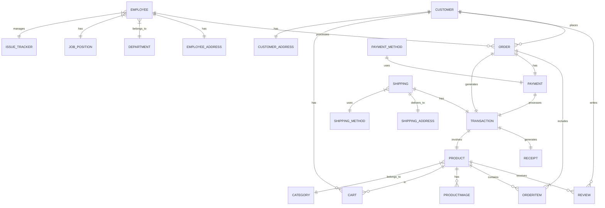

# Shoepee Database Design

This document outlines the database design for the Shoepee e-commerce system. The design is critical as it handles sensitive customer data, financial transactions, and inventory management.

## 1. Conceptual Design
High-level view of main entities and their relationships.



## 2. Logical Design
Entity relationships with attributes and relationships.

```mermaid
erDiagram
    CUSTOMER {
        int CustomerID PK
        string Username UK "NOT NULL"
        string FirstName "NOT NULL"
        string LastName "NOT NULL"
        string Email "NOT NULL"
        string Password "NOT NULL"
        string PhoneNumber
        int CustomerAddress FK
        string Gender
        datetime Birthday
    }
    EMPLOYEE {
        int EmployeeID PK
        string FirstName "NOT NULL"
        string LastName "NOT NULL"
        string PhoneNumber
        int EmployeeAddress FK
        string Gender
        datetime Birthday
        string Email
        string Password "NOT NULL"
        int Department FK
        decimal Salary
        string SSSNumber
        string PagIBIG
        string PhilHealth
        string TIN
        int IssueTrackerID FK
        int PositionID FK
        boolean IsAdmin "DEFAULT FALSE"
        boolean IsActive "DEFAULT TRUE"
    }
    PRODUCT {
        int ProductID PK
        string ProductName "NOT NULL"
        string Description
        decimal Price "NOT NULL"
        int Stock "NOT NULL"
        int CategoryID FK
    }
    ORDER {
        int OrderID PK
        int CustomerID FK "NOT NULL"
        datetime OrderDate "NOT NULL"
        decimal TotalAmount "NOT NULL"
        int EmployeeID FK
    }
    TRANSACTION {
        int TransactionID PK
        int OrderID FK
        int ShippingID FK
        int ReceiptID FK
        int ProductID FK
        int PaymentID FK
        int Quantity "DEFAULT 1"
    }
    SHIPPING {
        int ShippingID PK
        string ShippingStatus
        int ShippingAddressID FK
        int ShippingMethodID FK
    }
    CART {
        int CartID PK
        int CustomerID FK "NOT NULL"
        int ProductID FK "NOT NULL"
        int Quantity "DEFAULT 1"
        timestamp AddedAt "DEFAULT NOW"
        UK "CustomerID, ProductID"
    }
    REVIEW {
        int ReviewID PK
        int ProductID FK
        int CustomerID FK
        int Rating "CHECK (1-5)"
        string ReviewText
        datetime ReviewDate "NOT NULL"
    }
```

## 3. Physical Design
Complete database schema with data types, constraints, and relationships.

```mermaid
erDiagram
    %% Address Tables
    CUSTOMER_ADDRESS {
        int Customer_Address_ID "PK"
        varchar25 Street "NOT NULL"
        varchar25 Barangay "NOT NULL"
        varchar25 Town_City "NOT NULL"
        varchar25 Province "NOT NULL"
        varchar25 Region "NOT NULL"
        int4 Postal_Code "NOT NULL"
    }
    EMPLOYEE_ADDRESS {
        int Employee_Address_ID "PK"
        varchar25 Street "NOT NULL"
        varchar25 Barangay "NOT NULL"
        varchar25 Town_City "NOT NULL"
        varchar25 Province "NOT NULL"
        varchar25 Region "NOT NULL"
        int4 Postal_Code "NOT NULL"
    }
    SHIPPING_ADDRESS {
        int Shipping_Address_ID "PK"
        varchar25 Street "NOT NULL"
        varchar25 Barangay "NOT NULL"
        varchar25 Town_City "NOT NULL"
        varchar25 Province "NOT NULL"
        varchar10 Region "NOT NULL"
        int4 Postal_Code "NOT NULL"
    }

    %% Core Tables
    CUSTOMER {
        int Customer_ID "PK"
        varchar50 Username "UK NOT NULL"
        varchar50 First_Name "NOT NULL"
        varchar50 Last_Name "NOT NULL"
        varchar50 Email "NOT NULL"
        varchar255 Password "NOT NULL"
        varchar20 Phone_Number
        int Customer_Address "FK"
        varchar10 Gender
        datetime Birthday
    }
    EMPLOYEE {
        int Employee_ID "PK"
        varchar25 First_Name "NOT NULL"
        varchar25 Last_Name "NOT NULL"
        varchar20 Phone_Number
        int Employee_Address "FK"
        varchar10 Gender
        datetime Birthday
        varchar50 Email
        varchar255 Password "NOT NULL"
        int Department "FK"
        decimal10_2 Salary
        varchar20 SSS_Number
        varchar20 Pag_IBIG
        varchar20 PhilHealth
        varchar20 TIN
        int Issue_Tracker_ID "FK"
        int Position_ID "FK"
        boolean Is_Admin "DEFAULT FALSE"
        boolean Is_Active "DEFAULT TRUE"
    }
    PRODUCT {
        int Product_ID "PK"
        varchar100 Product_Name "NOT NULL"
        varchar500 Description
        decimal10_2 Price "NOT NULL"
        int Stock "NOT NULL"
        int Category_ID "FK"
    }

    %% Transaction Related Tables
    CART {
        int Cart_ID "PK"
        int Customer_ID "FK NOT NULL"
        int Product_ID "FK NOT NULL"
        int Quantity "DEFAULT 1"
        timestamp Added_At "DEFAULT NOW"
        UK "Customer_ID, Product_ID"
    }
    ORDERITEM {
        int OrderItem_ID "PK"
        int Order_ID "FK NOT NULL"
        int Product_ID "FK NOT NULL"
        int Quantity "NOT NULL"
        decimal10_2 Price "NOT NULL"
    }
    PAYMENT {
        int Payment_ID "PK"
        int Order_ID "FK"
        int Payment_Method_ID "FK"
        varchar50 Payment_Status "DEFAULT 'Pending'"
        datetime Payment_Date
        decimal10_2 Amount "NOT NULL"
    }
    TRANSACTION {
        int Transaction_ID "PK"
        int Order_ID "FK"
        int Shipping_ID "FK"
        int Receipt_ID "FK"
        int Product_ID "FK"
        int Payment_ID "FK"
        int Quantity "DEFAULT 1"
    }

    %% Configuration Tables
    SETTINGS {
        int id "PK"
        varchar100 store_name "DEFAULT 'Shoepee'"
        varchar100 store_email
        varchar20 store_phone
        text store_address
        decimal5_2 tax_rate "DEFAULT 0.00"
        decimal10_2 shipping_fee "DEFAULT 0.00"
        decimal10_2 free_shipping_threshold "DEFAULT 0.00"
        boolean maintenance_mode "DEFAULT FALSE"
        timestamp created_at "DEFAULT NOW"
        timestamp updated_at "ON UPDATE NOW"
    }
    SHIPPING_METHOD {
        int Shipping_Method_ID "PK"
        varchar50 Method_Name "UK"
        decimal10_2 Cost
        varchar50 Estimated_Delivery_Time
    }
    PAYMENT_METHOD {
        int Payment_Method_ID "PK"
        varchar100 Method_Name "NOT NULL"
        varchar100 Provider "NOT NULL"
        decimal10_2 Transaction_Fee
    }
```

## Key Features

1. Full employee management system with HR data (SSS, PhilHealth, TIN, PagIBIG)
2. Complete order processing system with order items tracking
3. Multi-address support (Employee, Customer, Shipping addresses as separate entities)
4. Product management with categories and images
5. Review and rating system with 1-5 scale validation
6. Multiple payment methods (Credit Card, E-Wallet, Cash on Delivery)
7. Multiple shipping methods with cost and delivery time estimates
8. Cart system with unique customer-product combinations
9. Store settings management with tax rates and shipping thresholds
10. Comprehensive transaction tracking with receipts
11. Issue tracking system for employees
12. Default admin account system

## Design Principles

1. Referential integrity through foreign key constraints
2. Data normalization (separate address entities)
3. Proper data type selection (VARCHAR lengths optimized)
4. Security features (password hashing)
5. Audit capabilities (timestamps on critical tables)
6. Default values for critical fields
7. Unique constraints where necessary (Username, Email)
8. Check constraints (Rating 1-5)
9. Cascade deletes where appropriate (e.g., ProductImage)
10. Proper indexing on foreign keys and unique constraints
``` 