# Shoepee Database Design

This document outlines the database design for the Shoepee e-commerce system. The design is critical as it handles sensitive customer data, financial transactions, and inventory management.

## 1. Conceptual Design
High-level view of main entities and their relationships.


## 2. Logical Design
Entity relationships with attributes and constraints.

```mermaid
erDiagram
    JOB_POSITION {
        int Position_ID PK "AUTO_INCREMENT"
        varchar50 Title "NOT NULL"
        varchar100 Description
    }
    
    DEPARTMENT {
        int Department_ID PK "AUTO_INCREMENT"
        varchar25 Department_Name "NOT NULL"
        varchar100 Description
    }
    
    ISSUE_TRACKER {
        int Issue_Tracker_ID PK "AUTO_INCREMENT"
        varchar100 Description
        varchar20 Status
    }
    
    EMPLOYEE_ADDRESS {
        int Employee_Address_ID PK "AUTO_INCREMENT"
        varchar25 Street "NOT NULL"
        varchar25 Barangay "NOT NULL"
        varchar25 Town_City "NOT NULL"
        varchar25 Province "NOT NULL"
        varchar25 Region "NOT NULL"
        int4 Postal_Code "NOT NULL"
    }
    
    CUSTOMER_ADDRESS {
        int Customer_Address_ID PK "AUTO_INCREMENT"
        varchar25 Street "NOT NULL"
        varchar25 Barangay "NOT NULL"
        varchar25 Town_City "NOT NULL"
        varchar25 Province "NOT NULL"
        varchar25 Region "NOT NULL"
        int4 Postal_Code "NOT NULL"
    }
    
    EMPLOYEE {
        int Employee_ID PK "AUTO_INCREMENT"
        varchar25 First_Name "NOT NULL"
        varchar25 Last_Name "NOT NULL"
        varchar20 Phone_Number
        int Employee_Address FK
        varchar10 Gender
        datetime Birthday
        varchar50 Email
        varchar255 Password "NOT NULL"
        int Department FK
        decimal10_2 Salary
        varchar20 SSS_Number
        varchar20 Pag_IBIG
        varchar20 PhilHealth
        varchar20 TIN
        int Issue_Tracker_ID FK
        int Position_ID FK
        boolean Is_Admin "DEFAULT FALSE"
        boolean Is_Active "DEFAULT TRUE"
    }
    
    CUSTOMER {
        int Customer_ID PK "AUTO_INCREMENT"
        varchar50 Username "NOT NULL UNIQUE"
        varchar50 First_Name "NOT NULL"
        varchar50 Last_Name "NOT NULL"
        varchar50 Email "NOT NULL"
        varchar255 Password "NOT NULL"
        varchar20 Phone_Number
        int Customer_Address FK
        varchar10 Gender
        datetime Birthday
    }
    
    CATEGORY {
        int Category_ID PK "AUTO_INCREMENT"
        varchar100 Category_Name "NOT NULL"
    }
    
    PRODUCT {
        int Product_ID PK "AUTO_INCREMENT"
        varchar100 Product_Name "NOT NULL"
        varchar500 Description
        decimal10_2 Price "NOT NULL"
        int5 Stock "NOT NULL"
        int Category_ID FK
    }
    
    PRODUCTIMAGE {
        int Image_ID PK "AUTO_INCREMENT"
        int Product_ID FK "NOT NULL"
        varchar255 Image_Path "NOT NULL"
        timestamp Created_At "DEFAULT CURRENT_TIMESTAMP"
    }
```



## 3. Physical Design
Complete database schema with exact data types and constraints.

```mermaid
erDiagram
    ORDER {
        int5 Order_ID PK "AUTO_INCREMENT"
        int5 Customer_ID FK "NOT NULL"
        datetime Order_Date "NOT NULL"
        decimal10_2 Total_Amount "NOT NULL"
        int5 Employee_ID FK
    }
    
    PAYMENT_METHOD {
        int5 Payment_Method_ID PK "AUTO_INCREMENT"
        varchar100 Method_Name "NOT NULL"
        varchar100 Provider "NOT NULL"
        decimal10_2 Transaction_Fee
    }
    
    SHIPPING_METHOD {
        int Shipping_Method_ID PK "AUTO_INCREMENT"
        varchar50 Method_Name "UNIQUE"
        decimal10_2 Cost
        varchar50 Estimated_Delivery_Time
    }
    
    SHIPPING_ADDRESS {
        int5 Shipping_Address_ID PK "AUTO_INCREMENT"
        varchar25 Street "NOT NULL"
        varchar25 Barangay "NOT NULL"
        varchar25 Town_City "NOT NULL"
        varchar25 Province "NOT NULL"
        varchar10 Region "NOT NULL"
        int4 Postal_Code "NOT NULL"
    }
    
    SHIPPING {
        int5 Shipping_ID PK "AUTO_INCREMENT"
        varchar20 Shipping_Status
        int5 Shipping_Address_ID FK
        int5 Shipping_Method_ID FK
    }
    
    PAYMENT {
        int Payment_ID PK "AUTO_INCREMENT"
        int Order_ID FK
        int Payment_Method_ID FK
        varchar50 Payment_Status "DEFAULT 'Pending'"
        datetime Payment_Date
        decimal10_2 Amount "NOT NULL"
    }
    
    RECEIPT {
        int5 Receipt_ID PK "AUTO_INCREMENT"
        decimal10_2 Tax_Amount
        decimal10_2 Total_Amount
        varchar20 Type
    }
    
    REVIEW {
        int5 Review_ID PK "AUTO_INCREMENT"
        int5 Product_ID FK
        int5 Customer_ID FK
        int1 Rating "NOT NULL CHECK (Rating >= 1 AND Rating <= 5)"
        varchar500 Review_Text
        datetime Review_Date "NOT NULL"
    }
    
    TRANSACTION {
        int5 Transaction_ID PK "AUTO_INCREMENT"
        int5 Order_ID FK
        int5 Shipping_ID FK
        int5 Receipt_ID FK
        int5 Product_ID FK
        int5 Payment_ID FK
        int5 Quantity "DEFAULT 1"
    }
    
    CART {
        int Cart_ID PK "AUTO_INCREMENT"
        int Customer_ID FK "NOT NULL"
        int Product_ID FK "NOT NULL"
        int Quantity "NOT NULL DEFAULT 1"
        timestamp Added_At "DEFAULT CURRENT_TIMESTAMP"
        UNIQUE "Customer_ID, Product_ID"
    }
    
    ORDERITEM {
        int OrderItem_ID PK "AUTO_INCREMENT"
        int Order_ID FK "NOT NULL"
        int Product_ID FK "NOT NULL"
        int Quantity "NOT NULL"
        decimal10_2 Price "NOT NULL"
    }
    
    SETTINGS {
        int id PK "AUTO_INCREMENT"
        varchar100 store_name "NOT NULL DEFAULT 'Shoepee'"
        varchar100 store_email
        varchar20 store_phone
        text store_address
        decimal5_2 tax_rate "DEFAULT 0.00"
        decimal10_2 shipping_fee "DEFAULT 0.00"
        decimal10_2 free_shipping_threshold "DEFAULT 0.00"
        boolean maintenance_mode "DEFAULT FALSE"
        timestamp created_at "DEFAULT CURRENT_TIMESTAMP"
        timestamp updated_at "DEFAULT CURRENT_TIMESTAMP ON UPDATE CURRENT_TIMESTAMP"
    }
```

## Key Features

1. Full employee management system with HR data (SSS, PhilHealth, TIN, PagIBIG)
2. Complete order processing system with order items tracking
3. Multi-address support (Employee, Customer, Shipping addresses as separate entities)
4. Product management with categories and images (ON DELETE CASCADE for images)
5. Review and rating system with 1-5 scale validation
6. Multiple payment methods (Credit Card, E-Wallet, Cash on Delivery) with transaction fees
7. Multiple shipping methods with cost and delivery time estimates
8. Cart system with unique customer-product combinations
9. Store settings management with tax rates and shipping thresholds
10. Comprehensive transaction tracking with receipts
11. Issue tracking system for employees
12. Default admin account system with secure password hashing

## Design Principles

1. Referential integrity enforced through foreign key constraints
2. Third normal form (3NF) with separate address entities
3. Precise data type selection with optimized lengths
4. Security features (password hashing, 255 chars for hashed passwords)
5. Audit capabilities (timestamps with automatic updates)
6. Appropriate default values for critical fields
7. Unique constraints (Username, Email, Shipping Method names)
8. Check constraints (Rating 1-5 validation)
9. Cascade deletes where appropriate (ProductImage)
10. Proper indexing on foreign keys and unique constraints
11. Data validation through NOT NULL constraints
12. Decimal precision for financial data (10,2)
``` 