# Shoepee Database Design

This document outlines the database design for the Shoepee e-commerce system. The design is critical as it handles sensitive customer data, financial transactions, and inventory management.

## 1. Conceptual Design
High-level view of main entities and their relationships.


## 2. Logical Design
Entity relationships with attributes and constraints.

```mermaid
erDiagram
    %% Independent Tables
    JOB_POSITION {
        Position_ID INT PK "AUTO_INCREMENT"
        Title VARCHAR50 "NOT NULL"
        Description VARCHAR100
    }
    
    DEPARTMENT {
        Department_ID INT PK "AUTO_INCREMENT"
        Department_Name VARCHAR25 "NOT NULL"
        Description VARCHAR100
    }
    
    ISSUE_TRACKER {
        Issue_Tracker_ID INT PK "AUTO_INCREMENT"
        Description VARCHAR100
        Status VARCHAR20
    }
    
    %% Address Tables
    EMPLOYEE_ADDRESS {
        Employee_Address_ID INT PK "AUTO_INCREMENT"
        Street VARCHAR25 "NOT NULL"
        Barangay VARCHAR25 "NOT NULL"
        Town_City VARCHAR25 "NOT NULL"
        Province VARCHAR25 "NOT NULL"
        Region VARCHAR25 "NOT NULL"
        Postal_Code INT4 "NOT NULL"
    }
    
    CUSTOMER_ADDRESS {
        Customer_Address_ID INT PK "AUTO_INCREMENT"
        Street VARCHAR25 "NOT NULL"
        Barangay VARCHAR25 "NOT NULL"
        Town_City VARCHAR25 "NOT NULL"
        Province VARCHAR25 "NOT NULL"
        Region VARCHAR25 "NOT NULL"
        Postal_Code INT4 "NOT NULL"
    }
    
    %% Core Tables
    EMPLOYEE {
        Employee_ID INT PK "AUTO_INCREMENT"
        First_Name VARCHAR25 "NOT NULL"
        Last_Name VARCHAR25 "NOT NULL"
        Phone_Number VARCHAR20
        Employee_Address INT FK
        Gender VARCHAR10
        Birthday DATETIME
        Email VARCHAR50
        Password VARCHAR255 "NOT NULL"
        Department INT FK
        Salary DECIMAL10_2
        SSS_Number VARCHAR20
        Pag_IBIG VARCHAR20
        PhilHealth VARCHAR20
        TIN VARCHAR20
        Issue_Tracker_ID INT FK
        Position_ID INT FK
        Is_Admin BOOLEAN "DEFAULT FALSE"
        Is_Active BOOLEAN "DEFAULT TRUE"
    }
    
    CUSTOMER {
        Customer_ID INT PK "AUTO_INCREMENT"
        Username VARCHAR50 "NOT NULL UNIQUE"
        First_Name VARCHAR50 "NOT NULL"
        Last_Name VARCHAR50 "NOT NULL"
        Email VARCHAR50 "NOT NULL"
        Password VARCHAR255 "NOT NULL"
        Phone_Number VARCHAR20
        Customer_Address INT FK
        Gender VARCHAR10
        Birthday DATETIME
    }
```



## 3. Physical Design
Complete database schema with relationships and constraints.


## Key Features

1. Full employee management system with HR data (SSS, PhilHealth, TIN, PagIBIG)
2. Complete order processing system with order items tracking
3. Multi-address support (Employee, Customer, Shipping addresses as separate entities)
4. Product management with categories and images (ON DELETE CASCADE for images)
5. Review and rating system with 1-5 scale validation
6. Multiple payment methods (Credit Card, E-Wallet, Cash on Delivery) with transaction fees
7. Multiple shipping methods with cost and delivery time estimates
8. Cart system with unique customer-product combinations
9. Store settings management with tax rates and shipping thresholds
10. Comprehensive transaction tracking with receipts
11. Issue tracking system for employees
12. Default admin account system with secure password hashing

## Design Principles

1. Referential integrity enforced through foreign key constraints
2. Third normal form (3NF) with separate address entities
3. Precise data type selection with optimized lengths
4. Security features (password hashing, 255 chars for hashed passwords)
5. Audit capabilities (timestamps with automatic updates)
6. Appropriate default values for critical fields
7. Unique constraints (Username, Email, Shipping Method names)
8. Check constraints (Rating 1-5 validation)
9. Cascade deletes where appropriate (ProductImage)
10. Proper indexing on foreign keys and unique constraints
11. Data validation through NOT NULL constraints
12. Decimal precision for financial data (10,2)
``` 